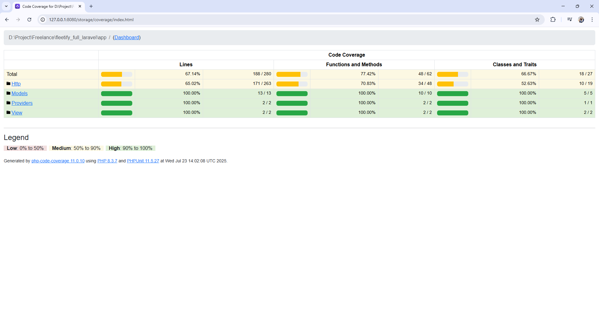

# Panduan Instalasi Fleetify Attendence

Sebuah perusahaan Multinasional memiliki jumlah karyawan diatas 50 karyawan, dan memiliki
berbagai macam Divisi atau departemen didalamnya. Karena banyaknya karyawan untuk
dikelola, perusahaan membutuhkan Sistem untuk Absensi guna mencatat serta mengevaluasi
kedisiplinan karyawan secara sistematis.

## Prasyarat

Sebelum memulai instalasi, pastikan komputer Anda telah memenuhi prasyarat berikut:

- PHP >= 8.2
- Composer
- MySQL
- Git

Stack

- Laravel 12
- Tailwind 4
- Auth : Breeze

## Langkah-langkah Instalasi

1. **Clone Repositori**

    ```bash
    git clone https://github.com/ar-kun/fleetify_full_laravel.git
    ```

2. **Pindah ke Direktori Proyek**

    ```bash
    cd fleetify_full_laravel
    ```

3. **Instal Dependensi**

    ```bash
    composer install
    ```

    ```bash
    npm install
    ```

4. **Salin Berkas Konfigurasi**

    ```bash
    cp .env.example .env
    ```

    Sesuaikan informasi konfigurasi database di dalam berkas `.env`.

5. **Buat Key Aplikasi**

    ```bash
    php artisan key:generate
    ```

6. **Migrasi Database**

    ```bash
    php artisan migrate
    ```

    Database testing : db_testing

7. **Buat Seeder Data Awal**

    ```
    php artisan db:seed
    ```

8. **Khusus Local Development**

    ```
    php artisan db:seed DevelopmentSeeder
    ```

9. **Jalankan Server Lokal**

    ```bash
    composer run dev
    ```

Proyek akan diakses pada `http://localhost:8080` / `http://127.0.0.1:8080` secara default.

### Development User

> - Email: fleetify@gmail.com
> - Password: password

### Generate Coverage Report

1. **Jalankan testing dengan coverage report: ./vendor/bin/phpunit --coverage-html ./storage/app/public/coverage.**
2. **Jalankan server web: php artisan serve.**
3. **Buka browser dan akses http://127.0.0.1:8000/storage/coverage/index.html (Sesuaikan host jika berbeda).**

### Coverage Result


